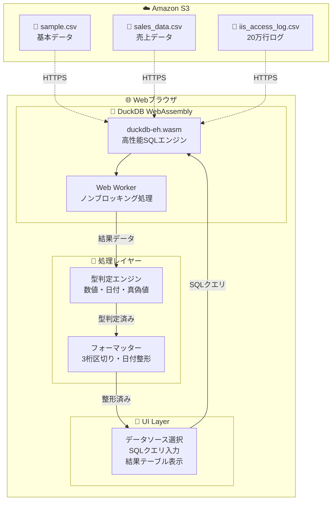

# 🏗️ DuckDB Analytics - アーキテクチャ図

## システム構成



## データフロー詳細

### 1. 📊 データソース (Amazon S3)
```
sample.csv        →  テスト用小データ (~1KB)
sales_data.csv    →  ECサイト売上 (~100KB) 
iis_access_log.csv →  Webログ 200,000行 (~49MB)
```

### 2. 🦆 DuckDB WebAssembly処理
```
①　S3から直接CSVを読み込み (read_csv_auto)
②　SQLクエリをWebAssembly内で実行
③　結果をJavaScriptオブジェクトで返却
④　Web Workerでメインスレッドをブロックしない
```

### 3. 🎨 UI処理 (Svelte)
```
①　データソース選択 → デフォルトクエリ自動設定
②　SQLクエリ実行 → DuckDBに送信
③　結果受信 → 型判定・フォーマット適用
④　テーブル表示 → 数値右寄せ・日付整形・行ストライプ
```

## 🚀 パフォーマンス特徴

- **ゼロサーバー**: ブラウザ内完結でサーバー不要
- **高速処理**: DuckDBの列指向処理で大容量データも瞬時
- **型安全**: TypeScriptとSvelteで開発効率向上
- **レスポンシブ**: TailwindCSSでモダンUI

## 🎯 LTデモポイント

1. **小→大のデータ**:  1KB → 49MB まで同じインターフェース
2. **リアルタイム分析**: クエリ変更→即座に結果表示
3. **ブラウザ完結**: サーバーレスでどこでも動作
4. **SQL標準**: 馴染みのあるSQLで複雑な分析も簡単
